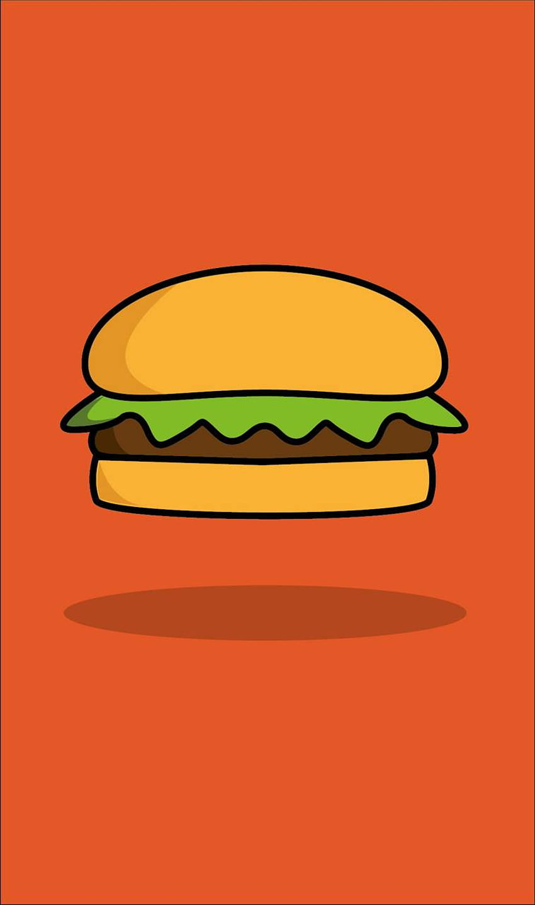
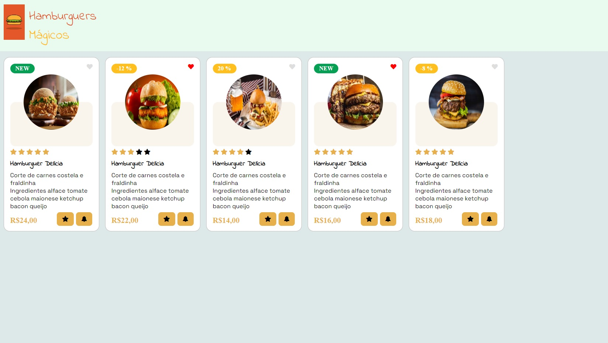
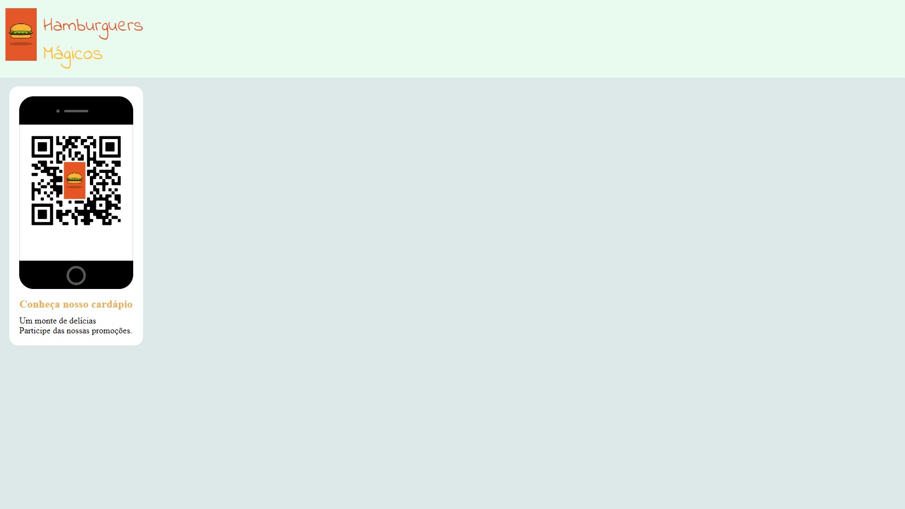
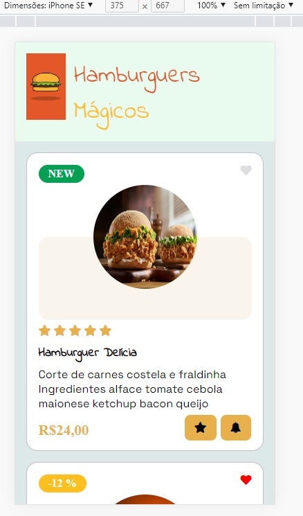
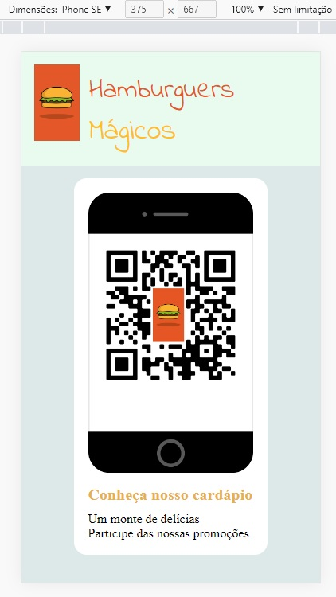
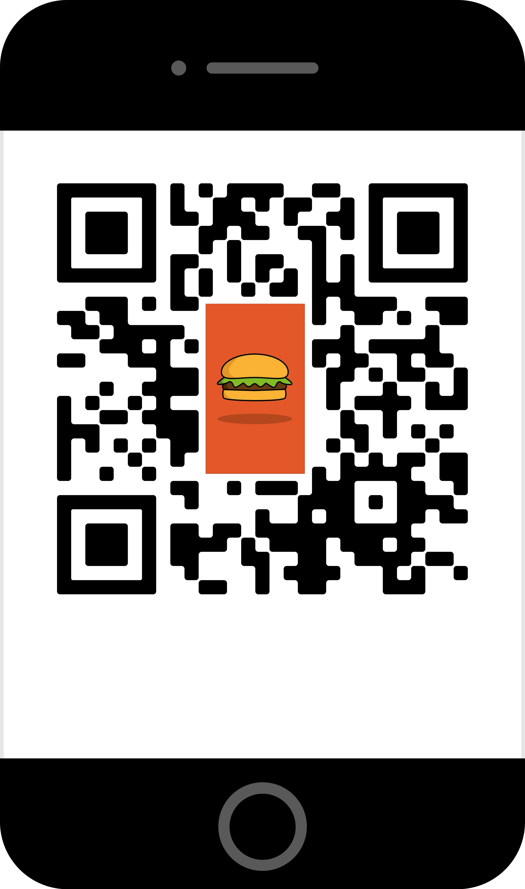

<h1 align="center">
  
   
  🍔 Hamburguers Mágicos
</h1>

  
  

  <b>Transformando tecnologia em sabor através de um cardápio digital interativo.</b>

  

---

### 📝 Sobre o Projeto

O **Hamburguers Mágicos** é um cardápio digital moderno desenvolvido para ser acessado via **QR Code**. O foco principal é a experiência do usuário (UX) em dispositivos móveis, permitindo a navegação por categorias e a montagem de pedidos em tempo real.

### 🛠 Checklist de Desenvolvimento

- [x] Design Responsivo (Mobile First)
- [x] Perfect Pixel implementation
- [ ] Renderização dinâmica via `database.js`
- [ ] Filtros de categoria por ID
- [ ] Gerador de QR Code integrado
- [ ] Sistema de Star Rating (Avaliação)
- [ ] Carrinho de compras com Sticky Bar
- [ ] Integração de pedido via WhatsApp
- [ ] Ajustar as informações do Readme.md

---

### 📱 Preview das Interfaces

#### Desktop

  
  

#### Mobile

  
  

---

### 🔗 QR Code de Acesso

Acesse o cardápio oficial através do link abaixo ou escaneando a imagem:

👉 **[Abrir Cardápio Digital](https://qrco.de/bdQMqr)**

  

---

### 🚀 Plano de Ação: Do Estático ao Dinâmico

#### **Fase 1: Refatoração da Infraestrutura**

- **Clean Code:** Unificação de classes CSS (`.product-img`) e limpeza de IDs estáticos.
- **Variáveis :root:** Padronização de cores Dark Premium e sombras modernas.

#### **Fase 2: Camada de Dados (`database.js`)**

- **Normalização:** Estruturação de JSON com IDs, categorias e preços.
- **Atributos de UX:** Inclusão de flags para descontos e itens novos.

#### **Fase 3: Engine de Renderização (`main.js`)**

- **Injeção Dinâmica:** Uso de Template Literals para criar os cards.
- **Intl.NumberFormat:** Formatação de moeda brasileira automática.
- **Filtros SPA:** Sistema de filtro por categoria sem refresh de página.

#### **Fase 4: UX Moderno & Interatividade**

- **Feedback Visual:** Animações ao adicionar itens ao carrinho.
- **Sticky Bar:** Rodapé flutuante com somatório de valores em tempo real.

---

### 🎨 Guia de Estilo

- **Cores:** Tema Dark Premium (Black & Gold)
- **Fontes:** \* `Space Grotesk` (Leitura Técnica e Preços)
  - `Indie Flower` (Branding e Títulos Lúdicos)
- **Imagens:** High Resolution Burgers

---

### 🏁 Próximos Passos

- [ ] Implementar a lista de pedidos detalhada no carrinho.
- [ ] Criar a função de "Copiar Pedido" formatado para o WhatsApp.
- [ ] Finalizar o sistema de acréscimos (modais).

---

Desenvolvido por <strong>Douglas Novato</strong> no ecossistema <strong>learnTECH</strong>.

