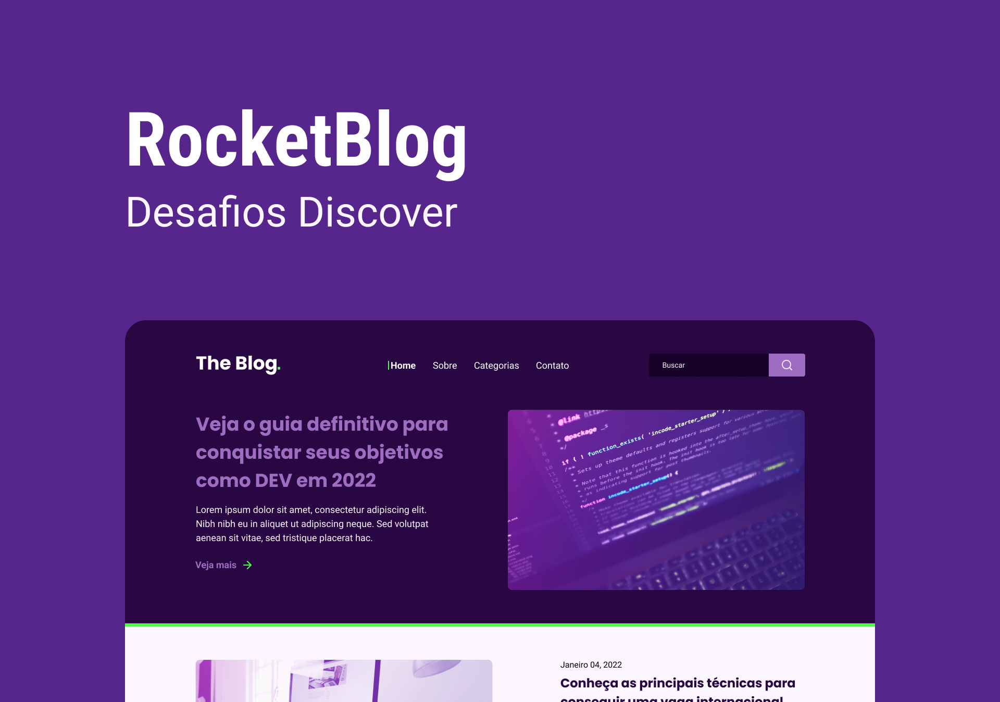
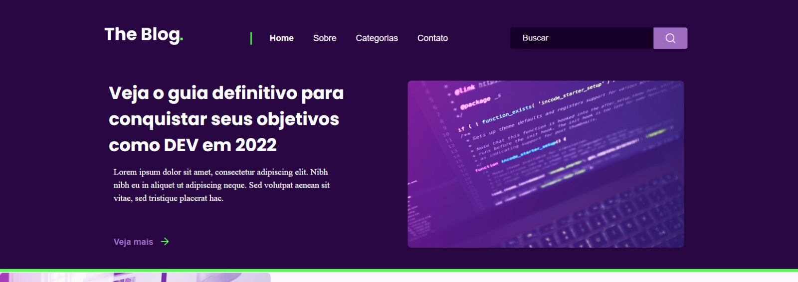
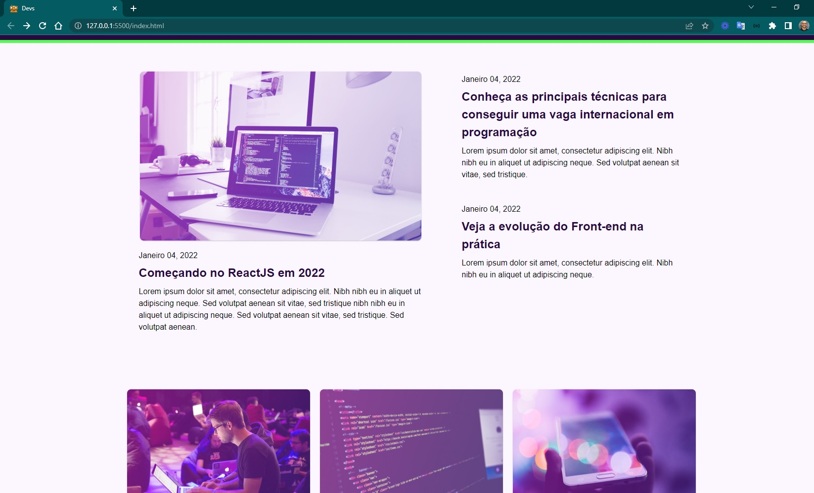
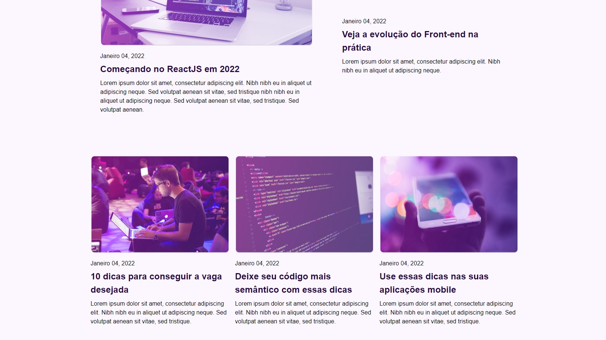
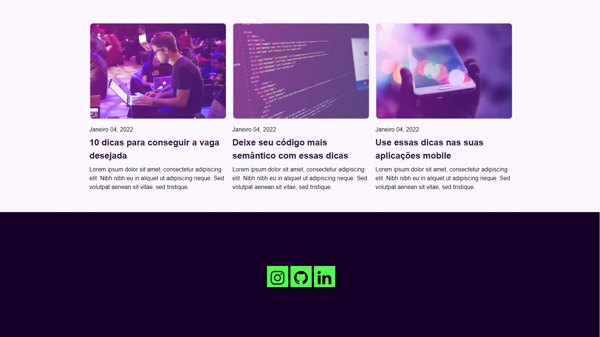
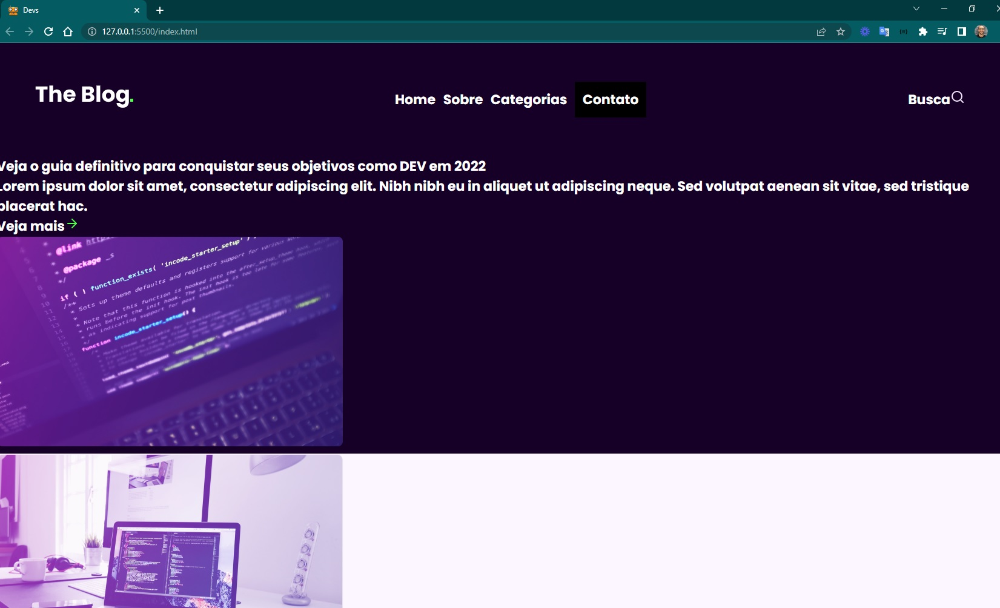
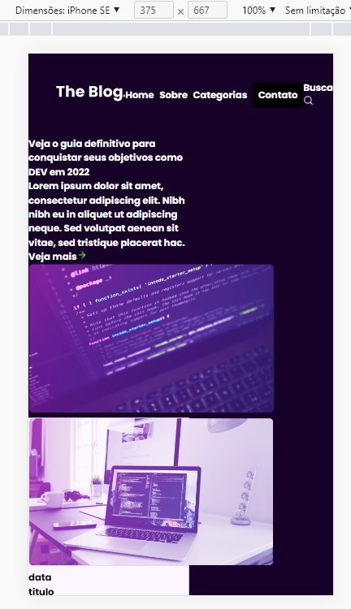

<h4 align="center"> 
	🚧 Rocket Blog 🚀
</h4>

<p align="center">
  
</p>    

## 💻 Sobre o desafio

Homepage para um blog de tecnologia, com estrutura completa de header, destaques, posts e rodapé.

**Nível:** Intermediário
**Tecnologias:** HTML e CSS
**Layout base:** [Figma oficial do desafio](https://www.figma.com/file/r4CsL6MPTAvE7EvJXjhFK4/DD-RocketBlog/duplicate)

## 💡 Conteúdos aplicados

- [Guia Estelar de HTML](https://app.rocketseat.com.br/node/o-guia-estelar-de-html)
- [Guia Estelar de CSS](https://app.rocketseat.com.br/node/o-guia-estelar-de-css)
- [Posicionando foguetes](https://app.rocketseat.com.br/node/posicionando-foguetes)
- [Formulários de outro planeta](https://app.rocketseat.com.br/node/formularios-de-outro-planeta)
- [Alinhando os planetas](https://app.rocketseat.com.br/node/flexbox)
- [App bonito, até nos textos](https://app.rocketseat.com.br/node/flexbox)
- [Guia completo de Flexbox — CSS-Tricks](https://css-tricks.com/snippets/css/a-guide-to-flexbox/)
- [Guia completo de Grid — CSS-Tricks](https://css-tricks.com/snippets/css/complete-guide-grid/)

## ✅ Requisitos do desafio

- [x] Estrutura do HTML
- [x] Header
- [x] Container
- [x] Destaques
- [x] Posts
- [x] Seção de rodapé

## 📋 Próximos passos

- [ ] Responsividade
- [ ] Responsividade das imagens
- [ ] Funcionalidade de busca
- [ ] Ajuste pixel-perfect

## 🎨 Style Guide

**Cores:**
```css
:root {
  --purple-bg: #290742;
  --dark-bg: #170027;
  --button-bg: #9e6dc2;
  --white: #fff;
  --light-purple: #fbf6ff;
  --green: #4fff4b;
}
```

**Tipografia:** Poppins (weight 700) e Roboto (weights 400 e 700)

## 📋 Status do projeto

- [x] Organização do README
- [x] Branches `main` e `developer`, uma branch por tarefa
- [x] Favicon
- [ ] [Learn Responsive Design](https://web.dev/learn/design/)
- [ ] [Learn CSS](https://web.dev/learn/css/)

## 🖥️ Telas finais

**Desktop:**
<p align="center">
   
   
   
   
   
</p>  

**Mobile:**
<p align="center">
   
</p>  

## 📚 Fonte

Desafio da [Rocketseat](https://www.rocketseat.com.br/) — [requisitos completos](https://efficient-sloth-d85.notion.site/Desafio-RocketBlog-807e38809814423e80469b080444db5e)

---

Feito com ❤️ por Douglas A. B. Novato 👋🏽 [Entre em contato!](https://www.linkedin.com/in/douglasabnovato/)

Participe da [comunidade aberta da Rocketseat](https://discord.gg/bacwY2gDCF)!