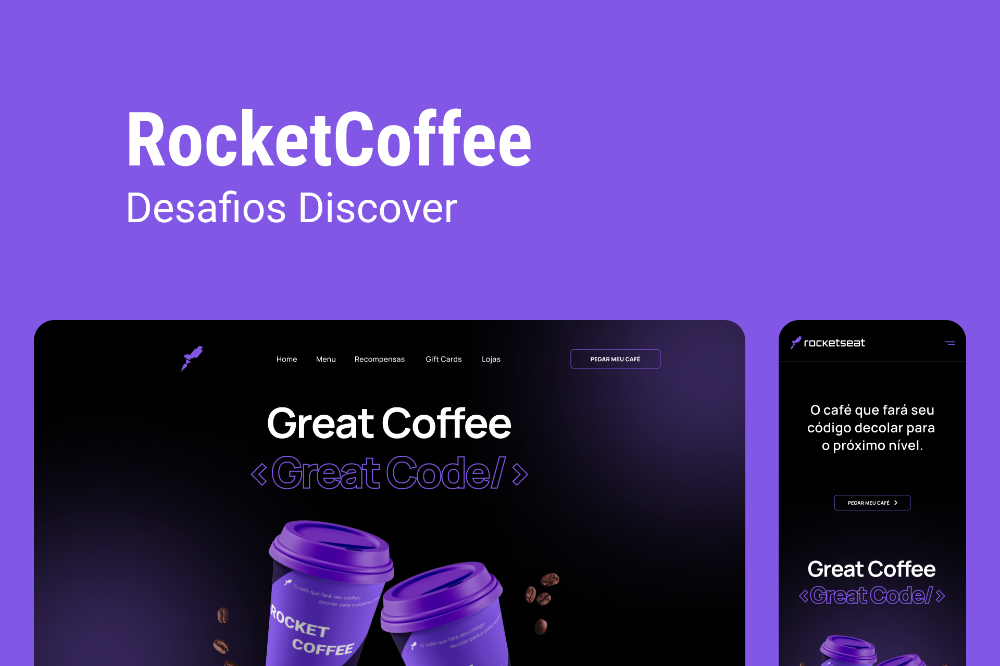
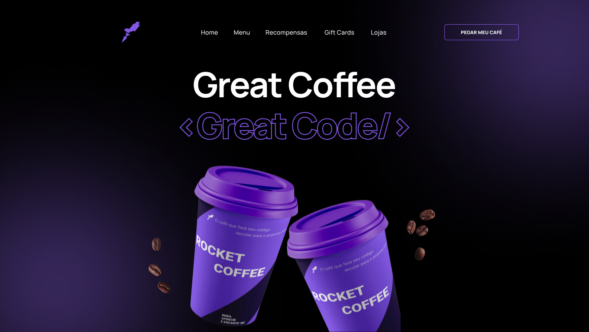
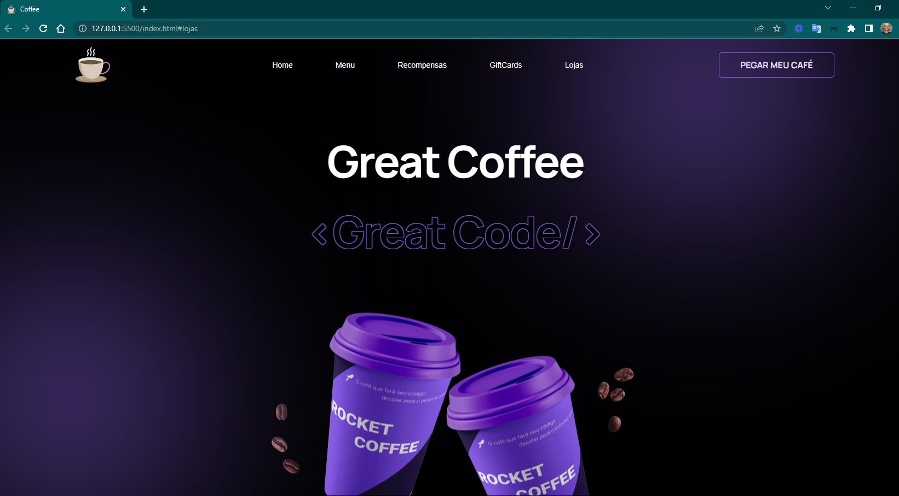
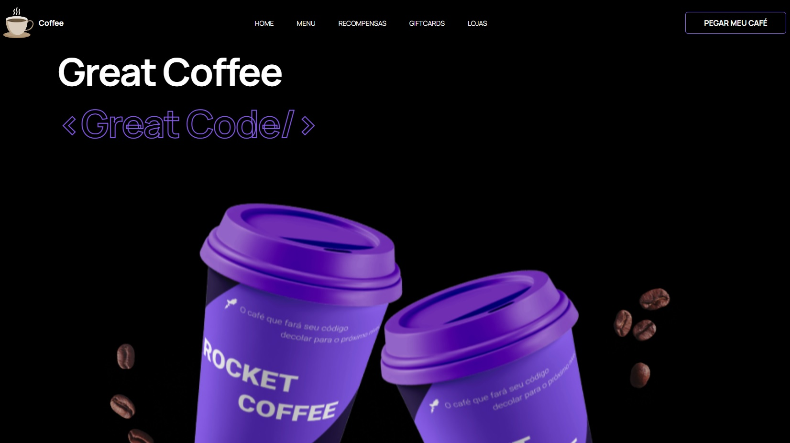
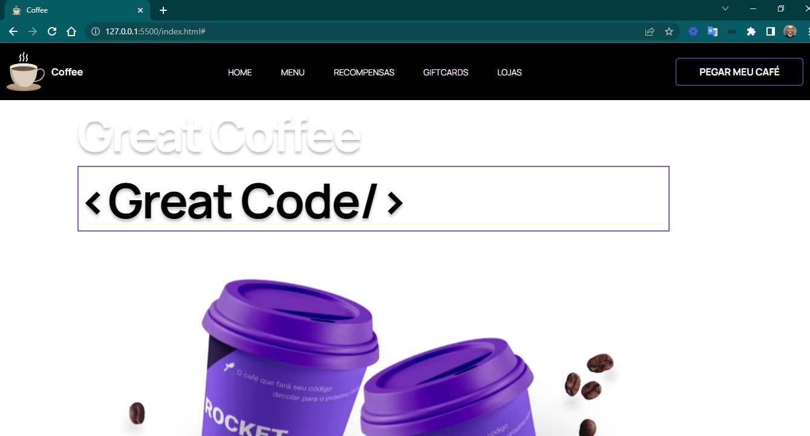
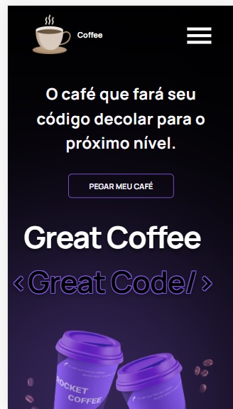
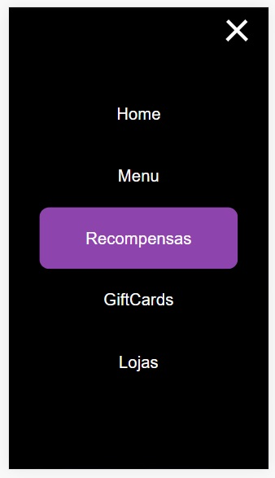
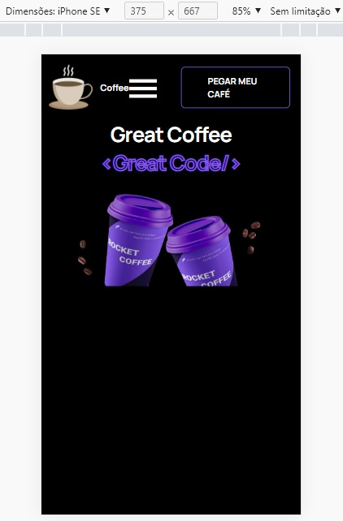

# ☕ Coffee Experience

> **Nota do CTO:** Este projeto não é apenas um cardápio digital; é uma vitrine tecnológica que une a cultura do café especial à engenharia de software moderna. Atualmente em fase de "ajuste fino", transicionando do estado funcional para o estado revolucionário.

---

## 🏛️ Parte 1: Referências & DNA do Produto

O diferencial deste projeto é que ele herda o DNA de marcas que dominam seus respectivos nichos, fundindo tradição e futurismo.

| Referência        | Conceito Herdado    | Aplicação no Projeto learnTECH                                            |
| :---------------- | :------------------ | :------------------------------------------------------------------------ |
| **Cheirin Bão**   | Afeição & Origem    | Storytelling sobre o cultivo, altitude e notas sensoriais (Mel, Frutas).  |
| **Grão Moente**   | Técnica & Precisão  | Layout limpo, foco em métodos (V60, Cold Brew) e clareza de ingredientes. |
| **Le Petit Café** | Sofisticação & Luxo | Tipografia serifada clássica, fotos macro e foco em confeitaria fina.     |
| **Planet Coffee** | Futurismo & Pop     | Identidade "Cosmic Edition", nomes criativos e uso de cores neon/roxo.    |

---

## 🚀 Parte 2: Development Roadmap

O desenvolvimento foi estruturado em sprints para garantir a integridade da arquitetura modular e a escalabilidade do ecossistema.

### Sprint 1: Arquitetura de Dados (Concluído ✅)

- **Ação:** Criação do `database.js`.
- **Objetivo:** Consolidar os 30+ itens identificados nas referências em um objeto JSON estruturado (ID, Nome, Categoria, Notas Sensoriais e Métodos).

### Sprint 2: UI/UX Revolucionária (Em Correção 🛠️)

- **Ação:** Desenvolvimento do `style.css` e `index.html`.
- **Identidade:** Tema _Dark Premium_ com uso do roxo (`#7159c1`) como cor primária.
- **Glassmorphism:** Cards com fundo semitransparente e desfoque (`backdrop-filter`).
- **Profundidade:** Efeito de gradiente radial simulação de ambiente "cósmico".

### Sprint 3: Engenharia de Injeção (Fase Atual ⚡)

- **Ação:** Sincronização do `main.js` com o DOM.
- **Objetivo:** Injeção dinâmica de dados. O JavaScript "lê" o banco e "escreve" os cards na tela.
- **Resiliência:** Implementação de sistema de _fallback_ para imagens e tratamento de erros de seletor.

### Sprint 4: Responsividade e Entrega (Próximo Passo 🏁)

- **Ação:** Ajustes em `responsive.css` e `print.css`.
- **Objetivo:** Visualização otimizada em dispositivos móveis e geração de fichas técnicas perfeitas para impressão.

---

## 🎯 Parte 3: A "Vibe" do Produto Final

O **Coffee Experience** é uma analogia viva entre o mundo do café e o mundo Tech:

- **Hardware:** O grão (origem, altitude, torra).
- **Software:** O método de preparo (V60, Prensa, Espresso).
- **Interface:** Design moderno com fontes _Playfair Display_ e _Inter_.

---

## 🛠️ Stack Tecnológica

- **Frontend:** HTML5, CSS3 (Modern Features).
- **Logic:** JavaScript (ES6+).
- **Design Pattern:** Modularização de dados e manipulação dinâmica de DOM.

---

<h4 align="center"> 
	🚧 Rocket  - versão 1 🚀
</h4>

  

### 💻 Sobre o desafio

Neste desafio você deverá desenvolver uma homepage para uma marca de café.

#### 💻 Techs

- Nível de dificuldade: Intermediário
- HTML
- CSS
- JavaScript

#### 💻 Como começar?

1 - Use o link do [Figma](https://www.figma.com/file/tFoovGllUttTebdUTDVdT8/RocketCoffee/duplicate) como base para o projeto. Também disponibilizamos para download todos os assets necessários (imagens e ícones), para fazer o download basta clicar no link acima.

2 - Leia com atenção todas as instruções do desafio.

3 - Bora codar! Lembre-se que você pode usar as tecnologias que se sentir mais confortável, mas também pode se desafiar usando novas techs, fazendo modificações e/ou adicionando funcionalidades no projeto como preferir. 🚀

4 - Compartilhe seu resultado ou tire suas dúvidas na nossa [**comunidade aberta**](https://discord.gg/bacwY2gDCF)

### 💡 Conteúdos Aplicados

Neste desafio você vai construir uma homepage para uma marca de café*.* Caso você ainda não tenha feito os cursos do Discover ou queira fazer uma revisão, segue abaixo uma lista dos cursos e documentações que podem te ajudar a resolver este desafio.

- [O guia estelar de HTML](https://app.rocketseat.com.br/node/o-guia-estelar-de-html)
- [O guia estelar de CSS](https://app.rocketseat.com.br/node/o-guia-estelar-de-css)
- [Posicionando foguetes](https://app.rocketseat.com.br/node/posicionando-foguetes)
- [Formulários de outro planeta](https://app.rocketseat.com.br/node/formularios-de-outro-planeta)
- [Alinhando os planetas](https://app.rocketseat.com.br/node/flexbox)
- [App bonito, até nos textos](https://app.rocketseat.com.br/node/flexbox)
- [O Guia Estelar de JavaScript](https://app.rocketseat.com.br/node/o-guia-estelar-de-java-script)
- [Pilotando com a DOM](https://app.rocketseat.com.br/node/pilotando-com-a-dom)

### ✅ [Requisitos](https://efficient-sloth-d85.notion.site/Desafio-RocketCoffee-7802895f0dd44da5a6f71a64badc7e72)

- [x] layout responsivo
- [x] layout do [Figma](https://www.figma.com/file/tFoovGllUttTebdUTDVdT8/RocketCoffee/duplicate)
- [x] Na versão mobile, ao clicar no menu hamburger deverá exibir um menu responsivo: aperfeiçoar o background
- [x] Adicionar `hover` nos botões.

### 🎨 Style Guide

#### 🎨 css

- [x] Para criar o stroke do título `<Great Code />` utilize a seguinte estilização:
      css
      text-shadow: -1px -1px 0 var(--button), 1px -1px 0 var(--button), -1px 1px 0 var(--button), 1px 1px 0 var(--button);
- Eu tinha utilizado o trecho a seguir, mas a primeira opção é a melhor.
  css
  -webkit-text-stroke: 2px var(--button);
  text-shadow: 0px 4px 4px rgba(0, 0, 0, 0.25);
  opacity: 1;
- [x] Adicionando animações: botões de menu

#### 🎨 Cores

- [x] Adicionar variáveis
      css
      :root {
      --backgrond: #000;
      --text-color: #FFF;
      --button: #8257E5;
      --border: #29292E;
      --border-menu-mobile: #A8A8B3;
      --text-color-menu-mobile: #E1E1E6;
      }

#### 🎨 Fontes

- [x] font-family: Manrope; font-weight: 400 e 700

### 📅 Entregas

A ideia é dominar o processo e o fluxo de desenvolver projetos e por isso, listados e descritos as tarefas em readme.

- [x] Logo
- [x] Header
- [x] Banner
- [x] Luzes no background
- [x] Menu com 5 Itens: estilizar hover
- [x] Background com os efeitos nos círculos
- [x] Botão: estilizar
- [x] criar âncoras do menu

#### 📅 Próximos passos

- [ ] Botão: uma funcionalidade
- [ ] estilizar seção main
- [ ] Hamburguer: na posição correto no mobile, usar as svg

#### 📅 Gestão do projeto

- [x] Organizando os detalhes do projeto no readme.md
- [x] Uma branch main e uma developer, uma branch para cada tarefa
- [x] Favicon

#### 📅 Aperfeiçoar em detalhes

- [ ] [Learn Responsive Design](https://web.dev/learn/design/)
- [ ] [Learn CSS](https://web.dev/learn/css/)

#### 📅 Telas Finais

- Desktop

  
  

- Mobile

   
   
   

#### 📅 Consultas

- [free coffee icons](https://www.flaticon.com/free-icons/coffee)
- [icons8 coffee icons](https://icons8.com.br/icons/set/coffee)
- [css_padding](https://www.w3schools.com/css/css_padding.asp)
- [exibir código](https://horadecodar.com.br/2020/04/14/como-exibir-codigo-html-em-uma-pagina-web/)
- [create-a-text-outline](https://www.educative.io/answers/how-to-create-a-text-outline-using-css)
- [codepen buttons](https://codepen.io/priosoft/pen/dMryaY)
- [visibility](https://developer.mozilla.org/pt-BR/docs/Web/CSS/visibility)

Feito com ❤️ por Douglas A B Novato. 👋🏽 [Entre em contato!](https://www.linkedin.com/in/douglasabnovato/)

Fonte do projeto na [Rocketseat](https://www.rocketseat.com.br/). 👋 Participe da [comunidade aberta](https://discord.gg/bacwY2gDCF)!
